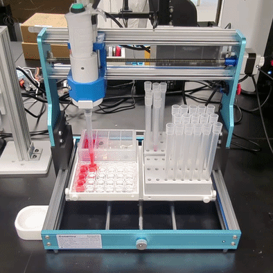
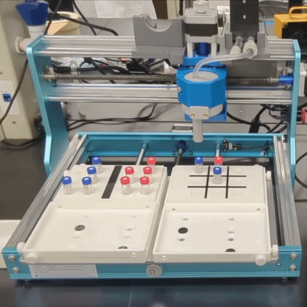

<h1>cnc-4-science</h1>

> Turn a low-cost, hobbyist CNC into a self-driving lab module.

<table>
  <tr>
    <td align="center" width="50%">
      <a href="https://youtu.be/hJAHL1_uhBs"></a>
      <br/><sub><a href="examples/liquid_handling/">Liquid handling</a> · <a href="https://youtu.be/hJAHL1_uhBs">full video</a></sub>
    </td>
    <td align="center" width="50%">
      <a href="https://youtu.be/-8ptOuS6o5s"></a>
      <br/><sub><a href="examples/vacuum_pick_and_place/">Pick and place</a> · <a href="https://youtu.be/-8ptOuS6o5s">full video</a></sub>
    </td>
  </tr>
</table>

`cnc-4-science` is a Python control library for **low-cost, easy-to-assemble,
open-source GRBL CNC routers** used as the gantry for scientific automation.
The target hardware is the kind of CNC a scientist can buy off the shelf for
a few hundred dollars, put together over a weekend, modify with 3D-printed
parts, and drive from Python — no proprietary controller, no vendor SDK, no
custom firmware. The reference examples in this repo run on a Genmitsu
3018-PROVer V2, but the library is GRBL-generic and works on any equivalent
machine.

It's the foundation for building things like **liquid handling** and
**pick-and-place of vials / consumables / small parts** (the two shipped
examples), and any other workflow that fits the pattern "move this tool to
that well and do something." Each module is built around a 3-step workflow:

| 1. Install a tool | 2. Configure the deck | 3. Write the workflow in Python |
| --- | --- | --- |
| Design and install your instrument on the CNC carriage \u2014 a pipette, a vacuum gripper, a fraction needle, whatever the workflow needs. The mechanical interface is a 3D-printed bracket; the rest is up to the tool. | Decide what labware and external modules sit on the deck and where. Describe it in YAML \u2014 standard SBS plates and tipracks via [Opentrons](https://labware.opentrons.com/#/create) definitions, or open / custom JSON for larger external modules that don't fit the SBS footprint. | Write a Python protocol against `cnc_machine_core` and a thin tool wrapper. The two YAML files (`tools/cnc_config.yaml` + `tools/<tool>_config.yaml`) hold every setup-specific number; the protocol stays portable. |

```bash
pip install cnc-4-science
```

See [`examples/README.md`](examples/README.md) for the standard 3-step user
journey every example follows. To bootstrap a brand-new CNC module with an
LLM coding agent, point it at [`examples/AGENTS.md`](examples/AGENTS.md) \u2014
it documents the directory layout, config schema, and tool-wrapper contract
that every example follows.

---

## Reference applications

Each example below is a complete, copyable project. Order the parts, follow
the assembly guide (~1 hour), set up the venv, edit two YAML files, and run.

| Example | Tool | Workflow | Sample workflow video |
| ------- | ---- | -------- | --------------------- |
| [`hello_cnc/`](examples/hello_cnc/) | Stock spindle | Home, move, spindle on/off — the hardware smoke test |   |
| [`liquid_handling/`](examples/liquid_handling/) | Sartorius Picus 2 pipette | Serial dilution across a 24-well plate | [YouTube](https://youtu.be/hJAHL1_uhBs) |
| [`vacuum_pick_and_place/`](examples/vacuum_pick_and_place/) | Vacuum gripper (spindle-driven) | Physical tic-tac-toe — CLI + optional browser UI | [YouTube](https://youtu.be/-8ptOuS6o5s) |

---

## Quick start

```bash
# 1. Pick an example and read its README + ASSEMBLY_INSTRUCTIONS.md.
#    Order/print the parts, assemble the hardware (~1 hour).

# 2. From the example folder:
python -m venv .venv
.\.venv\Scripts\Activate.ps1     # Windows
# source .venv/bin/activate      # Linux / macOS
pip install -r requirements.txt

# 3. Edit tools/cnc_config.yaml (COM port, travel bounds) and the tool config.

# 4. Run the protocol.
python protocols/<name>.py
```

> First time setting up a new CNC? Run
> [`examples/hello_cnc/hello_cnc.py`](examples/hello_cnc/) once to verify the
> gantry homes, jogs, and toggles the spindle. You don't need to re-run it
> for every protocol.
>
> Each example's `tools/cnc_config.yaml` ships with `z_heights:` calibrated
> for the reference build in its `ASSEMBLY_INSTRUCTIONS.md`. If your build
> differs, remeasure by hand — see
> [docs/SETUP.md §4](docs/SETUP.md#4-calibrate-z-heights).

> **New to the library?** Read [docs/SETUP.md](docs/SETUP.md) for the
> long-form software walkthrough (deck → labware → toolhead/driver →
> tool offsets → Z calibration → protocol).
>
> **Building your own application?** Copy [`examples/liquid_handling/`](examples/liquid_handling/)
> or [`examples/vacuum_pick_and_place/`](examples/vacuum_pick_and_place/) as
> a template — the conventions are documented in
> [`examples/AGENTS.md`](examples/AGENTS.md).

---

## API reference

### Motion

| Method | Description |
|---|---|
| `home()` / `origin()` | Home and park; or move to origin without homing. |
| `connect()` / `close()` | Open / close the serial connection to the controller. |
| `move_to_point(x, y, z)` | Absolute move (XYZ in mm). |
| `move_to_point_safe(x, y, z)` | Raise Z to clearance, move XY, lower Z. Prevents collisions with labware. |
| `move_to_point_safe_orthogonal(x, y, z, waypoint, axis_order)` | One-axis-at-a-time waypoint move (`yxy`, `xyx`, `xyxy`, `yxyx`). |
| `move_to_location(location, index)` | Move to a named position from `location_status.yaml`. |
| `spindle_on(rpm)` / `spindle_off()` | `M3` / `M5`. Doubles as the on/off for vacuum or solenoid tools wired to the spindle terminals. |
| `is_alarm()` / `recover_if_alarm()` | Alarm-state check + auto-rehome. Called internally before every move. |

### Deck and labware

The `cnc_deck` module provides `Well`, `Labware`, and `Deck` objects for
coordinate resolution:

```python
from cnc_machine_core import Deck
from opentrons_shared_data.labware import load_definition

deck = Deck("cnc_4_slot_deck")                               # built-in 4-slot deck (Genmitsu 3018)

# Standard SBS labware: load by Opentrons load name (no JSON file of your own).
plate = deck.load_labware_definition(
    "1", load_definition("corning_96_wellplate_360ul_flat", 1)
)

# Or a custom JSON for non-SBS gear (see custom_labware/ in the examples):
# plate = deck.load_labware("1", "custom_labware/my_rack.json")

x, y, z = plate["A1"].position()                             # absolute CNC coordinates
```

Protocols add the tool's XY offset at the call site —
`plate["A1"].position(offset=tool.offset)` — see
[`examples/liquid_handling/protocols/serial_dilution_demo.py`](examples/liquid_handling/protocols/serial_dilution_demo.py)
or [`examples/vacuum_pick_and_place/game_session.py`](examples/vacuum_pick_and_place/game_session.py)
for the live pattern.

Built-in decks — pick one explicitly (there is no default; the CNC footprint
should be visible at the call site):

- `cnc_4_slot_deck` — standard 4-slot (2×2), sized for the Genmitsu
  3018-PROVer V2 (~300×180 mm bed). Larger CNCs (3040, 6040, …) will likely
  want a custom deck with more slots — copy the JSON and re-measure the
  slot corners.
- `cnc_1_slot_deck` — single open slot at origin (no labware required)

Labware definitions are created with the
[Opentrons Labware Creator](https://labware.opentrons.com/#/create) — only
the XY well coordinates are used. Z heights are calibrated empirically per
(tool, labware, action) because they depend on the tool mount and labware
seating, not the labware geometry alone. See
[docs/SETUP.md §4](docs/SETUP.md#4-calibrate-z-heights).

### Direct positioning (no labware)

For simple setups, use the open deck and move to raw coordinates:

```python
from cnc_machine_core import Deck

deck = Deck("cnc_1_slot_deck")
cnc.move_to_point_safe(x=100, y=50, z=-20)
```

Regular grids without named wells can be described in YAML and addressed by
index via `move_to_location()`:

```yaml
vial_rack:
  num_x: 2          # columns
  num_y: 4          # rows
  x_origin: 166.5
  y_origin: 125
  z_origin: 0
  x_offset: 36
  y_offset: -36
```

The location index walks a full column before advancing.


### Deck state

The `deck_state` module tracks per-well status across all slots with YAML
persistence:

```python
from cnc_machine_core import DeckState

ds = DeckState()
ds.init_wells_from_labware("1", plate)
ds.init_from_preset({"1": {"A1": "sample"}})
ds.set_status("1", "A1", "processed")                # auto-saves
loc = ds.find_next(["1", "2"], "sample")             # ("1", "A2")
ds.count(["1"], "processed")
ds.summary()
```

Status strings are application-defined. A sample preset is in
[`examples/liquid_handling/deck_preset.yaml`](examples/liquid_handling/deck_preset.yaml).

### Z calibration

Z heights live in `tools/cnc_config.yaml` under `z_heights:` and are measured
empirically per `(tool, labware, action)` — see
[docs/SETUP.md §4](docs/SETUP.md#4-calibrate-z-heights). Each shipped example
includes calibrated values for its reference build; remeasure by hand if
yours differs.

### Tool wrapper contract

Every tool class follows the same shape, so the protocols read the same way
across examples:

```python
class MyTool:
    def __init__(self, cnc_machine, tool_config):
        self.cnc = cnc_machine
        self.offset = tool_config.get("offset", {"x": 0, "y": 0, "z": 0})
        # extract parameters from tool_config["parameters"]
```

See
[`examples/liquid_handling/tools/picus_pipette.py`](examples/liquid_handling/tools/picus_pipette.py)
for a wrapper around a vendor serial driver, and
[`examples/vacuum_pick_and_place/tools/vacuum_gripper.py`](examples/vacuum_pick_and_place/tools/vacuum_gripper.py)
for a wrapper that drives the CNC's spindle terminals directly (no separate
serial port).

---

## Authors and acknowledgements

Authors: Owen Melville, Kelvin Chow.

CNC-based scientific instruments inspired by the
[Keith Brown Lab](https://sites.bu.edu/kablab/) at Boston University [[1]][1] [[2]][2].

[1]: https://doi.org/10.1039/D4MH00797B
[2]: https://doi.org/10.1016/j.ohx.2024.e00601

## License

GNU General Public License v3.0 or later. See [LICENSE](LICENSE).
